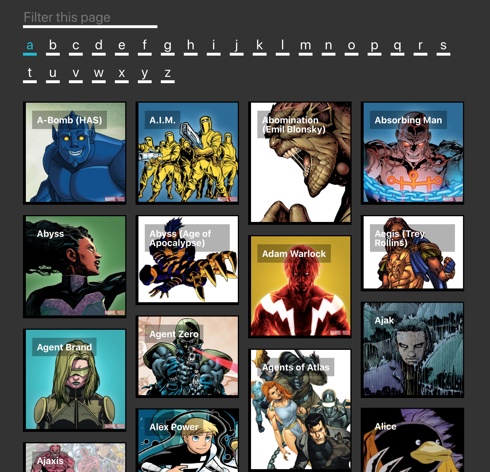

Marvel technical test
----

## How to run

Requires `node v12.16.2`, make sure you're on that before you start.

Run `yarn install`, then `yarn start`, then go to [http://localhost:3000](http://localhost:3000).

Run `yarn test` to run the test suite.

## Notes

Ideally this would use a server with some caching as there is a 3000 limit from Marvel, but for now this is fine.

Uses `styled-components` for styling, and `redux` to cache the calls client side.

I pushed the `.env` file also, since the repository is being shared privately.

My email is izaac.broadbent@gmail.com, feel free to reach out any time.
